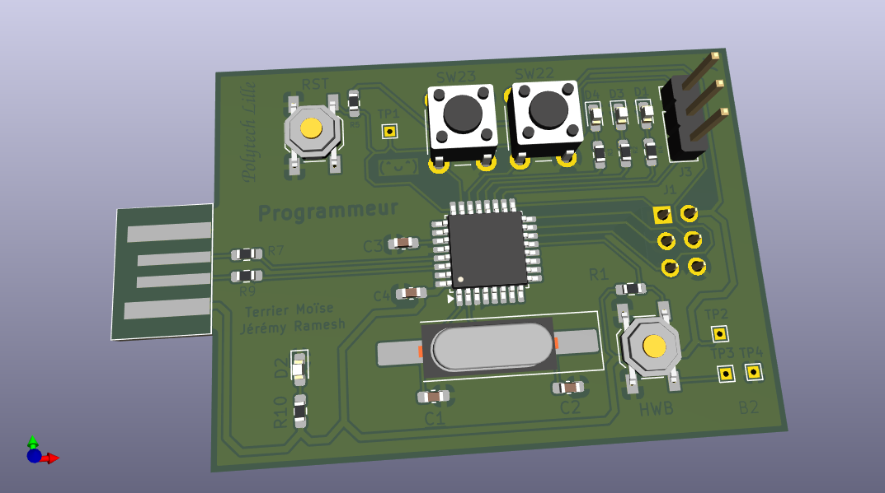

# AVR ISP Programmer

[](README.fr.md)

> Because this was a french project, most of the code was written in French

A custom In-System Programmer (ISP) designed to flash AVR microcontrollers via USB. This project encompasses the full stack: custom hardware design (PCB), USB firmware (LUFA), and a host PC tool (libusb).



## Features

- **Custom PCB:** Designed with KiCad, featuring an ATmega16U2 microcontroller.
- **Low-Level USB Communication:** Replaces the standard CDC class with raw IN/OUT endpoints using the LUFA stack.
- **SPI ISP Protocol:** Implements the Atmel AVR910 specification for reading device signatures and erasing/writing flash memory.
- **Page Mode Writing:** Supports modern AVR targets (like ATmega328P) using SPI page-mode flashing.
- **CLI Host Tool:** A custom C program using `libusb-1.0` to parse Intel HEX files and flash targets directly from a Linux terminal.

## Architecture

### 1. Hardware (`/hardware`)

The board is built around an ATmega16U2. It exposes a standard ISP interface (MISO, MOSI, SCK, RESET) to connect to target AVRs.

- Includes status LEDs and user buttons.
- KiCad schematics and PCB routing files are available in the `hardware/` directory.

### 2. Firmware (`/firmware`)

The brain of the programmer. Written in C using the [LUFA](http://www.fourwalledcubicle.com/LUFA.php) library.

- Processes `OUT` packets from the PC to execute SPI commands.
- Transmits AVR responses (signatures, flash reads) back to the PC via `IN` packets.

### 3. PC Software (`/software`)

A Linux command-line interface written in C.

- Communicates with the ATmega16U2 via `libusb-1.0`.
- Parses `.hex` files.
- Includes a dynamic target database to adjust page sizes and memory limits based on the detected target's ISP signature.

### 3. Tests (`/ISP_tests`)

Functions to test the hardware by ISP:

- `boutons.c`: test the boutons

## Installation & Build

### Prerequisites

You need the AVR toolchain and libusb installed on your system:

- Arch based

```bash
sudo pacman -S avr-gcc avr-libc avrdude libusb
```

- Debian based

```bash
sudo apt-get install gcc-avr avr-libc avrdude libusb-dev
```

### Building the Project

A root Makefile orchestrates the cross-compilation for both the PC host and the AVR firmware.

```bash
# Build firmware, PC software, and test examples
make all
```

### Flashing the Programmer Firmware

Connect the programmer to your PC via USB. Put the ATmega16U2 board into **DFU mode** (Hardware RESET), then flash the compiled LUFA firmware:

- For minicom (debugging):

```bash
make minicom
```

- For the main program

```bash
make prog
```

> Unplugging and replugging the USB cable it sometimes necessary to detect the AVR with the new firmawre.

## Usage

Connect the programmer to your PC via USB, and wire the ISP header to your target AVR (e.g., an Arduino Uno / ATmega328P).

**1. Where you put your C files**
In `code_to_flash` you put your C files. When you compile all the files (`make`) your C files are stored in the `hex` folder.

**2. Read Target Flash:**

```bash
make read
```

> Usefull to be sure that the code is properly written into the card

**3. Write Hex File to Target:**

```bash
# Example
make write hex/blind.hex
```
